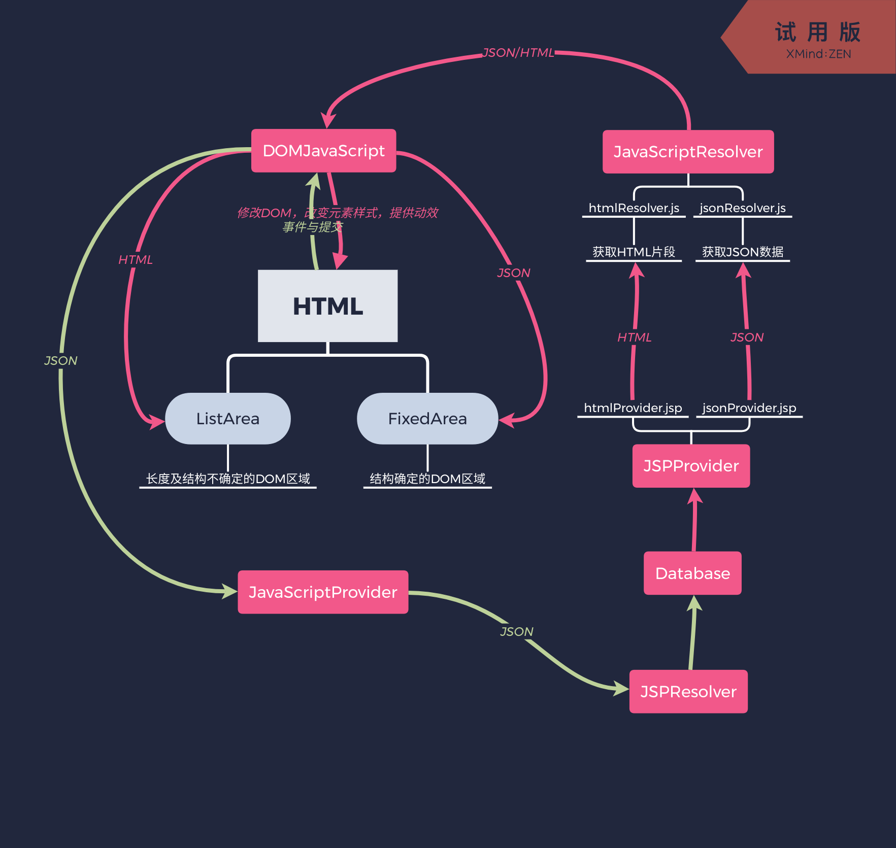
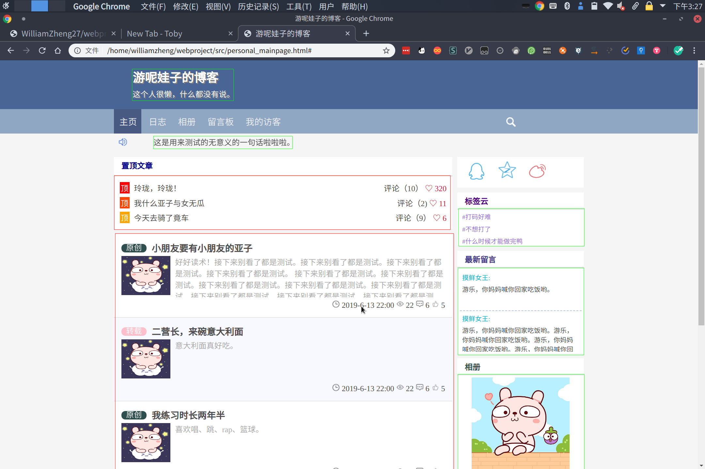

# 接口文档

## 整体架构

### 架构图

### 页面结构

- 红框：动态加载(填入HTML)
- 绿框：静态加载(预编写HTML，填写内容)

###　命名规范

#### HTML/CSS

全部小写，单词之间使用-连接

例：col-mid-8

#### JavaScript变量

驼峰命名，例：articleObj

## 前端接口定义

### DOM(DOM.js)

#### 主页(class Mainpage)

##### loadTop()

获取置顶文章

##### loadTag()

获取标签云

##### loadMore()

获取更多日志

##### goShare(s)

s：enum{"qzone","sina","qq"}

分享方法

#### 日志列表

#### 日志

#### 相册列表

#### 相册

### 获取

### 上传

## 后端接口定义

### 模板(/templates)

#### 主页日志列表(/templates/mainpage_article_list.jsp)

##### Request

- mode：获取模式
  - 0：获取全部日志
  - 1：从第from篇获取count篇
  - 2：获取标题含有topic字符串的日志(from和count依然有效)
- from (not required in mode 0)
- count (not required in mode 0)
- topic(mode 2 only)

##### Response

HTML内容

### 日志

### 照片

## 数据库定义

### 用户表
| 名 | 类型 | 长度 | 键 | 注释 |
| ------ | ------ | ------ | ------ | ------ |
| userID | long | 20 | primary key | 用户名ID |
| password | varchar | 20 | | 用户密码 |
| name | varchar | 20 | | 用户名 |
| profilePhoto | varchar | 255 | | 用户头像URL |
| time | datetime| | | 注册时间 |
| signature | text | | | 个性签名 |

### 博客表
| 名 | 类型 | 长度 | 键 | 注释 |
| ------ | ------ | ------ | ------ | ------ |
| blogID | long | 20 | primary key | 博客ID |
| userID | long | 20 | foreign key | 发表用户ID |
| labelID | int | 10 | foreign key | 分类ID |
| title | text | | | 博客标题 |
| content | longtext | | | 博客内容 |
| time | datetime | | | 发表时间 |
| likeCount | long | 20 | | 点赞数 |
| reprintCount | long | 20 | | 转载数 |
| pageviews | long | 20 | | 浏览量 |
| commentCount | long | 20 | | 评论数 |

### 博客分类表
| 名 | 类型 | 长度 | 键 | 注释 |
| ------ | ------ | ------ | ------ | ------ |
| labelID | long | 20 | primary key | 分类ID |
| name | varchar | 20 | | 分类名称 |
| description | text | | | 分类描述 |

### 留言表
| 名 | 类型 | 长度 | 键 | 注释 |
| ------ | ------ | ------ | ------ | ------ |
| messageID | long | 20 | primary key | 留言ID |
| hostID | long | 20 | foreign key | 主用户ID |
| guestID | long | 20 | foreign key | 留言用户ID |
| content | text | | | 留言内容 |
| time | datetime | | | 留言日期 |

### 相册表
| 名 | 类型 | 长度 | 键 | 注释 |
| ------ | ------ | ------ | ------ | ------ |
| albumID | long | 20 | primary key | 相册ID |
| userID | long | 20 | foreign key | 用户ID |
| pictureID | long | 20 | foreign key | 封面图片ID |
| name | text | | | 相册名称 |
| description | text | | | 相册描述 |
| time | datetime | | | 创建时间 |

### 相片表
| 名 | 类型 | 长度 | 键 | 注释 |
| ------ | ------ | ------ | ------ | ------ |
| pictureID | long | 20 | primary key | 相片ID |
| albumID | long | 20 | foreign key | 相册ID |
| name | text | | | 相片名称 |
| content | varchar | 255 | | 相片URL |
| likeCount | long | 20 | | 点赞数 |
| reprintCount | long | 20 | | 转载数 |
| time | datetime | | | 上传时间 |

### 访客记录表
| 名 | 类型 | 长度 | 键 | 注释 |
| ------ | ------ | ------ | ------ | ------ |
| recordID | long | 20 | primary key | 记录ID |
| hostID | long | 20 | foreign key | 主用户ID |
| guestID | long | 20 | foreign key | 访客ID |
| contentID | long | 20 | foreign key | 访问（博客或相片）ID |

### 评论表
| 名 | 类型 | 长度 | 键 | 注释 |
| ------ | ------ | ------ | ------ | ------ |
| commentID | long | 20 | primary key | 评论ID |
| userID | long | 20 | foreign key | 发表评论的用户ID |
| sourceID | long | 20 | foreign key | 评论（博客或相片或留言）ID |
| time | datetime | | | 评论时间 |
| content | text | | | 评论内容 |

## 附录：URI

 